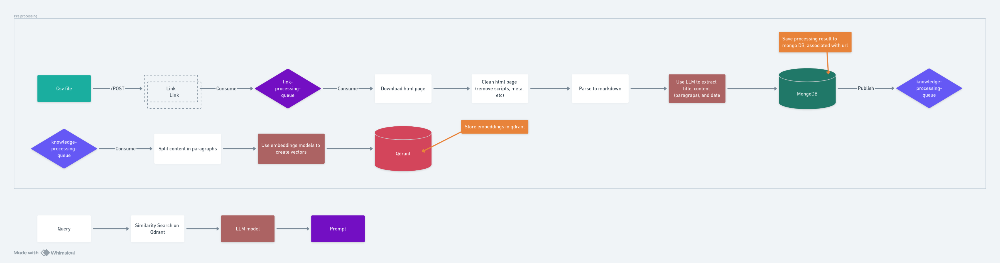

# RAG NestJS



This project is a web scraping and LLM-powered content analysis system built with NestJS. It scrapes articles from various sources, processes them using LLM (Language Learning Model), and stores them in a vector database for semantic search capabilities.

## Application Flow

The application follows a multi-step processing flow as shown in the diagram above:

1. **CSV Upload & Initial Processing**

   - Users upload a CSV file containing article URLs through the `/scraper/upload-csv` endpoint
   - The system processes the CSV and extracts URLs and sources

2. **Message Queue Processing**

   - URLs are published to a RabbitMQ queue for asynchronous processing
   - This ensures reliable handling of large numbers of URLs

3. **Web Scraping**

   - The system fetches content from each URL
   - HTML content is cleaned and converted to markdown format
   - Scraped data is stored in MongoDB

4. **LLM Processing**

   - The scraped content is processed by the LLM (Google Gemini)
   - Content is analyzed and transformed into knowledge representations

5. **Vector Storage**

   - Processed content is stored in the Qdrant vector database
   - This enables semantic search capabilities

6. **Query Processing**
   - Users can interact with the system through the `/agent` endpoint
   - The system uses the stored vector embeddings to provide relevant responses

## Features

- Web scraping of articles
- LLM-powered content analysis
- Vector database integration for semantic search
- RabbitMQ for message queuing
- MongoDB for data storage
- RESTful API endpoints

## Prerequisites

- Node.js (v16 or higher)
- pnpm package manager
- MongoDB
- RabbitMQ
- Qdrant vector database
- Google Gemini API key

## Installation

1. Clone the repository:

```bash
git clone <repository-url>
cd develops-today-llm-challenge
```

2. Install dependencies:

```bash
pnpm install
```

3. Create a `.env` file based on `.env.example`:

```bash
cp .env.example .env
```

4. Update the `.env` file with your configuration:

- Set your Gemini API key
- Configure MongoDB connection details
- Set RabbitMQ URL
- Configure Qdrant URL

## Environment Variables

The following environment variables are required for the application to function properly:

### LLM Configuration

- `GEMINI_API_KEY`: Your Google Gemini API key for LLM operations

### Database Configuration

- `DB_URI`: MongoDB connection URI (e.g., `mongodb://localhost:27017`)
- `DB_NAME`: Name of the MongoDB database
- `DB_USER`: MongoDB username
- `DB_PASSWORD`: MongoDB password
- `DB_PORT`: MongoDB port (default: 27017)

### Message Queue Configuration

- `RABBITMQ_URL`: RabbitMQ connection URL (e.g., `amqp://localhost`)

### Vector Database Configuration

- `QDRANT_URL`: Qdrant vector database URL (e.g., `http://localhost:6333`)

### Example .env file:

```env
GEMINI_API_KEY=your_gemini_api_key
RABBITMQ_URL=amqp://localhost

DB_URI=mongodb://localhost:27017
DB_NAME=scraper
DB_USER=admin
DB_PASSWORD=admin
DB_PORT=27017

QDRANT_URL=http://localhost:6333
```

## Running the Application

### Development Mode

```bash
pnpm start:dev
```

### Production Mode

```bash
pnpm build
pnpm start:prod
```

### Using Docker

```bash
docker compose up -d
```

## API Endpoints

### Scraper Endpoint

- `POST /scraper/upload-csv` - Upload a CSV file containing article URLs to be scraped
  - Accepts a multipart form-data with a 'file' field containing the CSV
  - CSV should contain 'URL' and 'Source' columns

### Agent Endpoint

- `POST /agent` - Generate a prompt using the LLM
  - Request body should contain a 'query' field with the text to process
  - Returns the generated prompt

## Project Structure

- `src/scraper/` - Web scraping functionality
- `src/llm/` - Language Learning Model integration
- `src/vectors/` - Vector database operations
- `src/rabbitmq/` - Message queue handling
- `src/database/` - Database operations and models

## Testing

Run the test suite:

```bash
pnpm test
```

Run tests with coverage:

```bash
pnpm test:cov
```

## Contributing

1. Fork the repository
2. Create your feature branch
3. Commit your changes
4. Push to the branch
5. Create a Pull Request

## License

This project is licensed under the UNLICENSED license.
